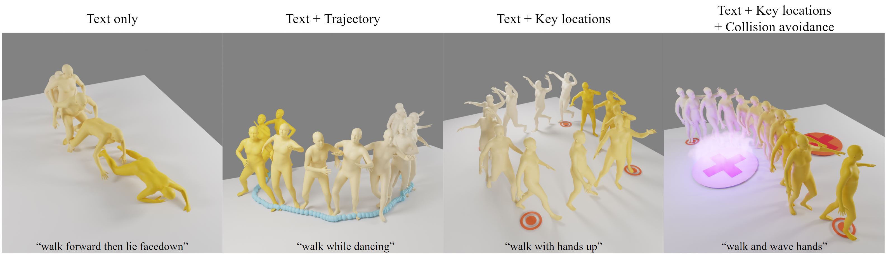
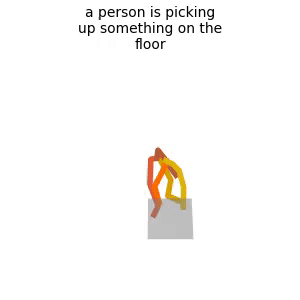
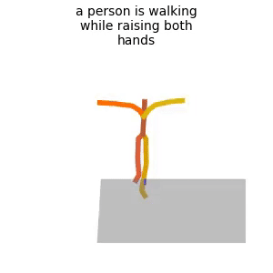
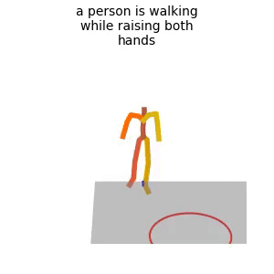
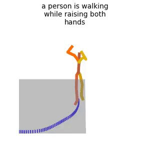

# GMD: Guided Motion Diffusion for Controllable Human Motion Synthesis

[](https://arxiv.org/abs/2305.12577)

The official PyTorch implementation of the paper [**"GMD: Controllable Human Motion Synthesis via Guided Diffusion Models"**](https://arxiv.org/abs/2305.12577).

For more details, visit our [**project page**](https://korrawe.github.io/gmd-project/).



## News

📢 
**20/Dec/23** - We release [DNO: Optimizing Diffusion Noise Can Serve As Universal Motion Priors](https://korrawe.github.io/dno-project/), a follow-up work that looks at how to effectively use diffusion model and guidance to tackle many motion tasks.
\
**28/July/23** - First release.


### Bibtex
If you find this code useful in your research, please cite:

```
@inproceedings{karunratanakul2023gmd,
  title     = {Guided Motion Diffusion for Controllable Human Motion Synthesis},
  author    = {Karunratanakul, Korrawe and Preechakul, Konpat and Suwajanakorn, Supasorn and Tang, Siyu},
  booktitle = {Proceedings of the IEEE/CVF International Conference on Computer Vision},
  pages     = {2151--2162},
  year      = {2023}
}
```


## Getting started

This code was tested on `Ubuntu 20.04 LTS` and requires:

* Python 3.7
* conda3 or miniconda3
* CUDA capable GPU (one is enough)


### 1. Setup environment

Install ffmpeg (if not already installed):

```shell
sudo apt update
sudo apt install ffmpeg
```
For windows use [this](https://www.geeksforgeeks.org/how-to-install-ffmpeg-on-windows/) instead.


### 2. Install dependencies

GMD shares a large part of its base dependencies with the [MDM](https://github.com/GuyTevet/motion-diffusion-model). However, you might find it easier to install our dependencies from scratch due to some key version differences.

Setup conda env:

```shell
conda env create -f environment_gmd.yml
conda activate gmd
conda remove --force ffmpeg
python -m spacy download en_core_web_sm
pip install git+https://github.com/openai/CLIP.git
```

Download dependencies:

<details>
  <summary><b>Text to Motion</b></summary>

```bash
bash prepare/download_smpl_files.sh
bash prepare/download_glove.sh
bash prepare/download_t2m_evaluators.sh
```
</details>

<details>
  <summary><b>Unconstrained</b></summary>

```bash
bash prepare/download_smpl_files.sh
bash prepare/download_recognition_unconstrained_models.sh
```
</details>

### 2. Get data

<!-- <details>
  <summary><b>Text to Motion</b></summary> -->

There are two paths to get the data:

(a) **Generation only** wtih pretrained text-to-motion model without training or evaluating

(b) **Get full data** to train and evaluate the model.


#### a. Generation only (text only)

**HumanML3D** - Clone HumanML3D, then copy the data dir to our repository:

```shell
cd ..
git clone https://github.com/EricGuo5513/HumanML3D.git
unzip ./HumanML3D/HumanML3D/texts.zip -d ./HumanML3D/HumanML3D/
cp -r HumanML3D/HumanML3D guided-motion-diffusion/dataset/HumanML3D
cd guided-motion-diffusion
cp -a dataset/HumanML3D_abs/. dataset/HumanML3D/
```


#### b. Full data (text + motion capture)

**[Important !]** 
Because we change the representation of the root joint from relative to absolute, you need to replace the original files and run our version of `motion_representation.ipynb` and `cal_mean_variance.ipynb` provided in `./HumanML3D_abs/` instead to get the absolute-root data.

**HumanML3D** - Follow the instructions in [HumanML3D](https://github.com/EricGuo5513/HumanML3D.git),
then copy the result dataset to our repository:


Then copy the data to our repository
```shell
cp -r ../HumanML3D/HumanML3D ./dataset/HumanML3D
```

### 3. Download the pretrained models

Download both models, then unzip and place them in `./save/`. 

Both models are trained on the HumanML3D dataset.

[trajectory model](https://polybox.ethz.ch/index.php/s/vQWmohE6dNP3uny)

[motion model](https://polybox.ethz.ch/index.php/s/D63LEliIBmtpvdd)


## Motion Synthesis
<details>
  <summary><b>Text to Motion - <u>Without</u> spatial conditioning</b></summary>

This part is a standard text-to-motion generation.
### Generate from test set prompts
Note: We change the behavior of the `--num_repetitions` flag from the original MDM repo to facilitate the two-staged pipeline and logging. We only support `--num_repetitions 1` at this moment.

```shell
python -m sample.generate --model_path ./save/unet_adazero_xl_x0_abs_proj10_fp16_clipwd_224/model000500000.pt --num_samples 10
```

### Generate from your text file

```shell
python -m sample.generate --model_path ./save/unet_adazero_xl_x0_abs_proj10_fp16_clipwd_224/model000500000.pt --input_text ./assets/example_text_prompts.txt
```

### Generate from a single prompt - no spatial guidance

```shell
python -m sample.generate --model_path ./save/unet_adazero_xl_x0_abs_proj10_fp16_clipwd_224/model000500000.pt --text_prompt "a person is picking up something on the floor"
```

</details>

<details>
  <summary><b>Text to Motion - <u>With</u> keyframe locations conditioning</b></summary>

### Generate from a single prompt - condition on keyframe locations
The predefined pattern can be found in `get_kframes()` in `sample/keyframe_pattern.py`. You can add more patterns there using the same format `[(frame_num_1, (x_1, z_1)), (frame_num_2, (x_2, z_2)), ...]` where `x` and `z` are the location of the root joint on the plane in the world coordinate system.


```shell
python -m sample.generate --model_path ./save/unet_adazero_xl_x0_abs_proj10_fp16_clipwd_224/model000500000.pt --text_prompt "a person is walking while raising both hands" --guidance_mode kps
```



(In development) Using the `--interactive` flag will start an interactive window that allows you to choose the keyframes yourself. The interactive pattern will override the predefined pattern.
</details>

<details>
  <summary><b>Text to Motion - <u>With</u> keyframe locations conditioning <u>and</u> obstacle avoidance</b></summary>

Similarly, the pattern is defined in `get_obstacles()` in `sample/keyframe_pattern.py`. You can add more patterns using the format `((x, z), radius)` currently we only support circle obstacle due to the ease of defining SDF, but you can add any shape with valid SDF.


```shell
python -m sample.generate --model_path ./save/unet_adazero_xl_x0_abs_proj10_fp16_clipwd_224/model000500000.pt --text_prompt "a person is walking while raising both hands" --guidance_mode sdf --seed 11
```



</details>

<details>
  <summary><b>Text to Motion - <u>With</u> trajectory conditioning</b></summary>

### Generate from a single prompt - condition on a trajectory
The trajectory-conditioned generation is a special case of keyframe-conditioned generation, where all the frames are keyframes.
The sample trajectory we used can be found in `./save/template_joints.npy`. You can also use your own trajectory by providing the list of `ground_positions`.

```shell
python -m sample.generate --model_path ./save/unet_adazero_xl_x0_abs_proj10_fp16_clipwd_224/model000500000.pt --text_prompt "a person is walking while raising both hands" --guidance_mode trajectory
```



(In development) Using the `--interactive` flag will start an interactive window that allows you to draw a trajectory that will override the predefined pattern.

</details>

**You may also define:**
* `--device` id.
* `--seed` to sample different prompts.
* `--motion_length` (text-to-motion only) in seconds (maximum is 9.8[sec]).
* `--progress` to save the denosing progress.

**Running those will get you:**

* `results.npy` file with text prompts and xyz positions of the generated animation
* `sample##_rep##.mp4` - a stick figure animation for each generated motion.
* `trajec_##_####` - a plot of the trajectory at each denoising step of the <u>trajectory model</u>. The final trajectory is then used to generate the motion.
* `motion_trajec_##_####` - a plot of the trajectory of the generated motion at each denoising step of the <u>motion model</u>.


You can stop here, or render the SMPL mesh using the following script.

### Render SMPL mesh

To create SMPL mesh per frame run:

```shell
python -m visualize.render_mesh --input_path /path/to/mp4/stick/figure/file
```

**This script outputs:**
* `sample##_rep##_smpl_params.npy` - SMPL parameters (thetas, root translations, vertices and faces)
* `sample##_rep##_obj` - Mesh per frame in `.obj` format.

**Notes:**
* The `.obj` can be integrated into Blender/Maya/3DS-MAX and rendered using them.
* This script is running [SMPLify](https://smplify.is.tue.mpg.de/) and needs GPU as well (can be specified with the `--device` flag).
* **Important** - Do not change the original `.mp4` path before running the script.

**Notes for 3d makers:**
* You have two ways to animate the sequence:
  1. Use the [SMPL add-on](https://smpl.is.tue.mpg.de/index.html) and the theta parameters saved to `sample##_rep##_smpl_params.npy` (we always use beta=0 and the gender-neutral model).
  1. A more straightforward way is using the mesh data itself. All meshes have the same topology (SMPL), so you just need to keyframe vertex locations. 
     Since the OBJs are not preserving vertices order, we also save this data to the `sample##_rep##_smpl_params.npy` file for your convenience.


## Training GMD

GMD is trained on the **HumanML3D** dataset.
### Trajectory Model
```shell
python -m train.train_trajectory
```
### Motion Model
```shell
python -m train.train_gmd
```

Essentially, the same command is used for both the trajectory model and the motion model. You can select which model to train by changing the `train_args`. The training options can be found in `./configs/card.py`.

* Use `--device` to define GPU id.
* Add `--train_platform_type {ClearmlPlatform, TensorboardPlatform}` to track results with either [ClearML](https://clear.ml/) or [Tensorboard](https://www.tensorflow.org/tensorboard).

## Evaluate
All evaluation are done on the HumanML3D dataset.

### Text to Motion

* Takes about 20 hours (on a single GPU)
* The output of this script for the pre-trained models (as was reported in the paper) is provided in the checkpoints zip file.


```shell
python -m eval.eval_humanml --model_path ./save/unet_adazero_xl_x0_abs_proj10_fp16_clipwd_224/model000500000.pt
```

#### Text to Motion - <u>With</u> trajectory conditioning
For each prompt, we use the ground truth trajectory as conditions.

```shell
python -m eval.eval_humanml --model_path ./save/unet_adazero_xl_x0_abs_proj10_fp16_clipwd_224/model000500000.pt --full_traj_inpaint
```

#### Text to Motion - <u>With</u> keyframe locations conditioning
For each prompt, 5 keyframes are sampled from the ground truth motion. The ground locations of the root joint in those frames are used as conditions.


```shell
python -m eval.eval_humanml_condition --model_path ./save/unet_adazero_xl_x0_abs_proj10_fp16_clipwd_224/model000500000.pt
```


## Acknowledgments

We would like to thank the following contributors for the great foundation that we build upon:

[MDM](https://github.com/GuyTevet/motion-diffusion-model), [guided-diffusion](https://github.com/openai/guided-diffusion), [MotionCLIP](https://github.com/GuyTevet/MotionCLIP), [text-to-motion](https://github.com/EricGuo5513/text-to-motion), [actor](https://github.com/Mathux/ACTOR), [joints2smpl](https://github.com/wangsen1312/joints2smpl), [MoDi](https://github.com/sigal-raab/MoDi).

## License
This code is distributed under an [MIT LICENSE](LICENSE).

Note that our code depends on other libraries, including CLIP, SMPL, SMPL-X, PyTorch3D, and uses datasets that each have their own respective licenses that must also be followed.
